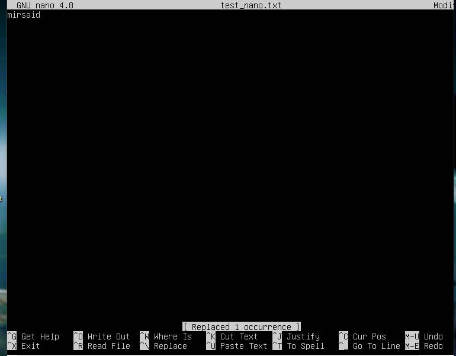

## 1-task: Virtual boxda Ubuntu 20.04 interfeyssiz ##o'rnatish

Ushbu taskda Ubuntu Server 20.04 GUI siz versiyasini virtualbox orqali ornatdik.
##Natijalar:
Tizim muvaffaqiyatli ishga tushirildi
Yechimlar ishlab chiqildi

## Skrinshotlar: Tizim ishga tushgan holat

## 2-task: Vazifa shu haqidakim, yangi foydalanuvchi ##yaratish va adm ga qo'shish

Bu topshiriqda men bobbiceltigar nomli foydalanuvchi yaratdim.
terminalga ushbu kodni yozdim:
sudo adduser bobbiceltigar
keyin foydalanuvchi qo'shildi
sudo usermod -aG adm bobbiceltigar

## 3-task: Operatsion tizim tarmoq sozlamalari

Mashina nomini o'zgartirdim.

keyin esa timezonasini o'zgartirdim Asia/Tashkent qildim.

Keyin esa DNS serverlarni sozlash uchun amallar bajardim.ya'ni inet manzilni bilish uchun ip a buyrug'ini yozdim.

So'ngra DNS server ip manzillarini netplan fayllaridan o'zgartirdik.

keyin ping so'zrovlar orqali O'zgartirilgan shlyuz IP manzillarni ishlayotganini tekshirdik.

## 4-task: OS yangilanishi.

bu qismda sudo apt-get update va sudo apt-get upgrade buyruqlaridan foydalanib yangilashni bajardim.

## 5-task: Sudo buyrug'idan foydalanish

birinchi navbatda, yangi foydalanuvchi yaratamiz. Yaratilgan foydalanuvchiga sudo buyrug'ini bajarishga ruxsat berish uchun buyruqdan foydalaning sudo adduser user-2 sudo buyrug'ini kiritamiz hamda user-2 yangi foydalanuvchini root ga biriktirib yangi yangi hostname beramiz. hostname nomi new-hostname

so'ng exec bash buyrug'i orqali hostname ishlatamiz

## 6-task: Vaqt xizmatini o'rnatish va sozlash

Bu yerda timedatectl set-ntp on buyrug'i orqali vaqtni sozlashni bajardim.

## 7-task: Matn muharrirlarini o'rnatish va ulardan foydalanish

Men VIM , NANO va JOE matn muharrirlarini tanladim va fayllarni joe text_joe.txt yaratdim vim text_vim.txt va nano text_nano.txt.

VIM faylga o'zimni nikcnameni yozib saqladim. Saqlash va VIMdan chiqish uchun saqlash uchun :w, keyin chiqish uchun foydalaning :q.shundan :wq

Keyingisi NANO faylda nicknameni yozdim
Saqlash va NANOdan chiqish uchun saqlash uchun ctrl + O + Enter, keyin chiqish uchun foydalaning ctrl + X.

Keyingisi esa Joe faylda. Saqlash va JOE dan chiqish uchun dan foydalandim ctrl + K + X

Fayllarni saqlamasdan o'zgartirish va chiqish.
VIM faylni ichidagi ma'lumotni 21 Schol 21 ga o'zgartiridm va faylni saqlamasdan chiqdim.

xuddi shu ishni NANO faylda bajardim.

Keyingisi JOE faylda bajarilgan.

Fayl (so'z) mazmunini qidirish va so'zni istalgan boshqa so'z bilan almashtirish funktsiyalari.

VIM:
Terminalda vim test_vim.txt buyrug'ini yozamiz.
So'z qidirish uchun: /word yozing va Enter tugmasini bosamiz.
So'zni almashtirish uchun:
:%s/oldword/newword/g yozing (oldword o'rniga eski so'zni, newword o'rniga yangi so'zni yozamiz).
Enter tugmasini bosamiz.
Chiqish va saqlash uchun: ESC → :wq.

Xuddi shu ish NANO faylda.
NANO:
Terminalda nano test_nano.txt buyrug'ini yozamiz.
So'z qidirish uchun: Ctrl+W ni bosamiz va qidirayotgan so'zni yozamiz.
CTRL + \ O'zgartirish funksiyasini faollashtirish uchun bosamiz . Topilgan so'zni almashtirmoqchi bo'lgan so'zni kiritamiz va Enter tugmasini bosamiz. Y Topilgan so'zning joriy nusxasini almashtirish uchun bosamiz . A Topilgan so'zning barcha nusxalarini almashtirish uchun bosamiz .
Saqlash va chiqish uchun: Ctrl+O → Enter → Ctrl+X.

Keyingisi JOE faylda bajarilgan.
JOE:
Terminalda joe test_joe.txt buyrug'ini yozamiz.
So'z qidirish uchun: Ctrl+K va keyin F tugmalarini bosamiz.
Almashtirish uchun Ctrl+K va keyin R tugmalarini bosamiz.
Saqlash va chiqish uchun: Ctrl+K va keyin X.

## 8-task. SSHD xizmatini o'rnatish va asosiy sozlash.

-SSH xizmatini o'rnatish uchun buyruqdan foydalandim sudo apt install openssh-server. O'rnatishdan so'ng SSHd xizmati avtomatik ravishda ishga tushadi. Tasdiqlash uchun buyruqdan foydalandim sudo sytemctl status ssh.

SSHd xizmatini 2022-portga tiklash uchun /etc/ssh/sshd_config buyruq yordamida faylni tahrirlash kerak sudo nano /etc/ssh/sshd_config. Yo'q qatorni topib #Port 22, izohni olib tashlab #va 22ni 2022 gs o'zgartirdim. O'zgarishlarni saqladim va quyidagi buyruq yordamida sudo systemctl restart ssh xizmatini qayta ishga tushirdim . Tasdiqlash uchun buyruqdan foydalandim sudo sytemctl status ssh.

Buyruq ps aux | grep sshd tizimda ishlayotgan barcha jarayonlar ro'yxatini ko'rsatish va sshdularning nomidagi har qanday jarayonlarni qidirish uchun ishlatiladi. Bu bizga SSHd server jarayoni hozirda tizimda ishlayotganligini tekshirish imkonini beradi .

Sshd jarayonining mavjudligini ko'rsatish uchun buyruqdan foydalandim ps aux | grep sshd.

ps: Ushbu buyruq tizimda ishlayotgan joriy jarayonlarning oniy tasvirini xabar qilish uchun ishlatiladi.
aux: Bu parametr psbarcha jarayonlarning batafsil roʻyxatini, shu jumladan terminal (yoki fon jarayonlari) bilan bogʻliq boʻlmagan jarayonlarni va ularning holati maʼlumotlarini koʻrsatishni bildiradi. Xususan, u quyidagilarni anglatadi:
a: Faqat joriy foydalanuvchi uchun emas, balki barcha foydalanuvchilar uchun jarayonlarni ko'rsatish.
u: Foydalanuvchiga yo'naltirilgan formatni ko'rsatish. Bunga jarayonni boshlagan foydalanuvchi, jarayonning boshlanish vaqti va jarayonning protsessor va xotiradan foydalanishi kiradi.
x: Terminalga biriktirilmagan jarayonlarni ko'rsatish (masalan, demonlar). : Bu buyruqning chiqishini buyruqning kiritilishiga
|yo'naltiruvchi quvur operatori . : Bu buyruq boshqa buyruqning chiqishida ma'lum bir naqshni qidirish uchun ishlatiladi. : Bu ps buyrug'ining chiqishidagi qatorni topish uchun foydalaniladigan qidiruv namunasidir . Agar uning nomi bilan ishlaydigan jarayon bo'lsa , u ko'rsatiladi. \psgrep
grep
sshdgrepsshdsshd

Keyingi netstatni ishlatish kerak edi. lekin o'rnatilmagan edi. Men uni sudo apt install net-tools
buyrug'i orqali o'rnatdim.

SSH xizmatining 2022-portda tinglayotganligini tekshirish uchun sudo netstat -tan
buyrug'idan foydalanamiz.
-t: TCP protokolini ko'rsatadi.
-a: Tinglayotgan va faol ulanishlarni ko'rsatadi.
-n: Ma'lumotlarni sonli formatda ko'rsatadi (DNSni tekshirmaydi).
Natijadagi ustunlarning ma'nosi:
tcp: Protokol turi (TCP).
0: Yuborilayotgan va qabul qilinayotgan ma'lumotlarning holati.
0.0.0.0:2022: SSH xizmatining barcha interfeyslarda 2022-portni tinglayotganligini bildiradi.
0.0.0.0:\*: Bu portdagi har qanday ulanishni qabul qiladi.
LISTEN: Port tinglash holatida ekanligini bildiradi.

## 9-task. Yuqori qismini o'rnatish uchun htop yordam dasturlari buyruqni ishlatadi sudo apt-get install top htop.

topdagi chiqishlar:
Yuqori buyruqning chiqishi aniqlanadi:
ish vaqti: 29 daqiqa
avtorizatsiya qilingan foydalanuvchilar soni: 1 foydalanuvchi
umumiy tizim yuki: 0,00, 0,01, 0,09
jami jarayonlar soni: 95 ta
protsessor yuki: 0,3 us
xotira yuki:
jarayonning 9,7/1971,6 pid.

htopdagi qiymatlar

## 10-task. Fdisk yordam dasturidan foydalanish.

Qattiq diskning nomi: VBOX HARDDISK.
Imkoniyatlar 10 GiB.
Tarmoqlar soni 20971520.
Swap hajmi 10737418240 bytes.

## 11-task. df yordam dasturidan foydalanish.

-dfIldiz bo'limi uchun ishga tushirish buyrug'i (/):

bo'lim hajmi: 8408452
ishlatilgan bo'sh joy: 4387568
bo'sh joy: 3572168
ishlatilgan foiz: 56%
Bo'lim hajmi, foydalanilgan bo'sh joy va bo'sh joy uchun ishlatiladigan o'lchov birligi odatda baytlarda ko'rsatiladi. Biroq, dfavtomatik ravishda har bir qiymat uchun eng mos birlikni tanlaydi va uni mos ravishda ko'rsatadi. Misol uchun, Sizeustun bo'lim hajmiga qarab gigabayt (GB) yoki terabayt (TB) qiymatlarini ko'rsatishi mumkin.
Ustun %Usehozirda foydalanilayotgan bo'limning foizini ko'rsatadi.

-Ildiz bo'limi (/) uchun df -Th buyrug'ini ishga tushirish:

bo'lim hajmi: 8.1G
ishlatilgan bo'sh joy: 4.2G
bo'sh joy: 3.5G
ishlatilgan foiz: 56 %

Bo'lim hajmi, foydalanilgan bo'sh joy va bo'sh joy uchun ishlatiladigan o'lchov birligi odatda baytlarda ko'rsatiladi. Biroq, dfavtomatik ravishda har bir qiymat uchun eng mos birlikni tanlaydi va uni mos ravishda ko'rsatadi. Misol uchun, Sizeustun bo'lim hajmiga qarab gigabayt (GB) yoki terabayt (TB) qiymatlarini ko'rsatishi mumkin.
Ildiz bo'limi uchun fayl tizimi turi ustunda ko'rsatiladi Type. Linux uchun keng tarqalgan fayl tizimi turlariga ext2, ext3, ext4 va btrfs kiradi.

## 12-task. Du yordam dasturidan foydalanish

-Buyruqni bajarish: du.

-/home, /var, /var/log papkalarining hajmini chiqardim (baytlarda, odamlar o'qishi mumkin bo'lgan formatda).

-/var/log dagi barcha tarkibning hajmini chiqardim (jami emas, balki \* dan foydalanib har bir ichki kiritilgan element).

## 13-task. Ncdu yordam dasturini o'rnatish va ishlatish

-ncdu Buyruq yordamida yordam dasturini o'rnatish sudo apt-get install ncdu.

-/home, /var, /var/log papkalarining hajmini chiqarish.

## 14-task.Tizim jurnallari bilan ishlash

-Fayllar mazmunini ko'rish uchun /var/log/dmesg, /var/log/syslog, va buyrug'idan /var/log/auth.log foydalanishimiz mumkin less. Buyruqlar sudo less /var/log/dmesg, sudo less /var/log/syslog, va sudo less /var/log/auth.log.

Oxirgi muvaffaqiyatli kirish vaqtini, foydalanuvchi nomini va kirish usulini topish uchun:
auth.log faylida “foydalanuvchi uchun ochilgan sessiya” iborasini quyidagi buyruq yordamida qidiring:
sudo grep "Accepted" /var/log/auth.log

## 15-task. CRON ish rejalashtiruvchisidan foydalanish.

Har 2 daqiqada ish vaqti buyrug'ini bajaradigan cron ishini yaratish uchun quyidagi amallarni bajaramiz:

crontab -e Terminalda buyruqni ishga tushirish orqali crontab muharririni ochish uchun .
crontab fayliga quyidagi qatorni qo'shish _/2 _ \* \* \* /usr/bin/uptime >> /var/log/uptime.log.
Ushbu satr har 2 daqiqada ish vaqti buyrug'ini ishga tushiradi va natijani faylga qo'shadi /var/log/uptime.log.

-Ijro haqida jurnal satrlarini topish uchun buyruqni bajaring sudo grep CRON /var/log/syslog. Bu buyruq cron ishini bajarish jurnallarini o'z ichiga olgan syslog faylida CRON
so'zini o'z ichiga olgan qatorlarni ko'rsatadi.

Ish rejalashtiruvchisidan barcha vazifalarni olib tashlash uchun buyruqni bajaring crontab -r.
Ishlayotgan buyruqni tekshirish uchun crontab -l.
crontab faylni tozlagandan so'ng ushbu crontab -l buyrug'i qo'llaniladi.

